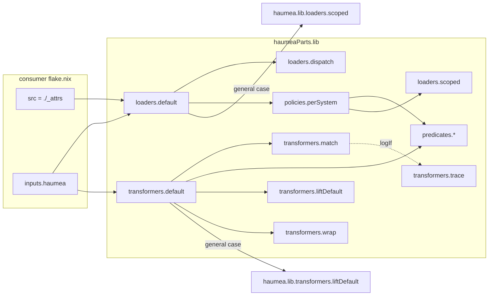
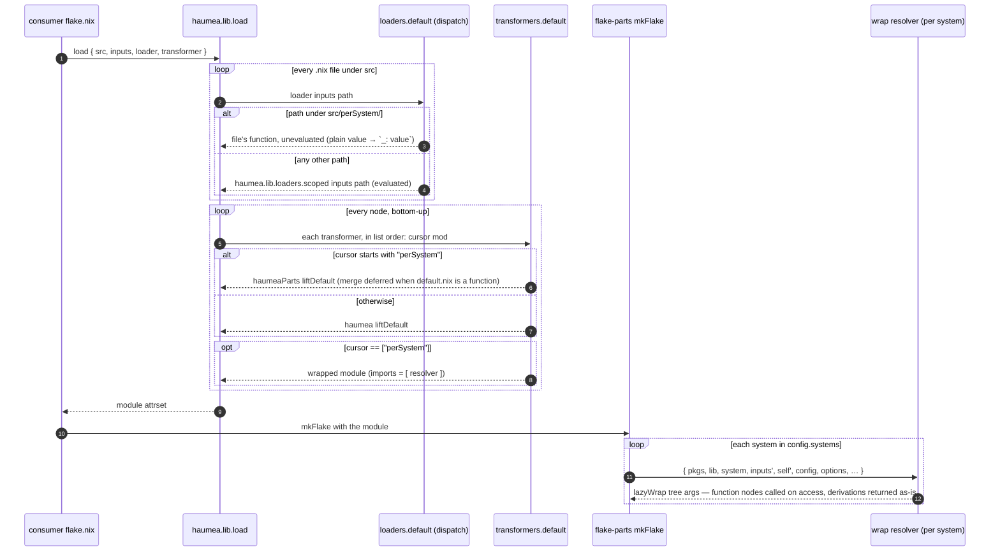

# haumeaParts — Specification

> **proj:** haumeaParts · **kind:** spec · **status:** wip · **updated:** 2026-09-27

---

## Purpose

`haumeaParts` is a small pure-Nix library that bridges **haumea** (filesystem-to-attrset loader) and **flake-parts** (flake module system). It provides loaders and transformers so a user can express an entire Nix flake as a directory tree — including the `perSystem` subtree, which requires deferred evaluation — without manual wiring in `flake.nix`.

The library ships loaders (`scoped`, `dispatch`), transformers (`liftDefault`, `wrap`, `match`, `trace`), `runIf` predicates, ready-made dispatch policies, and a default loader and transformer list that wire them together. This spec covers their contracts.

---

## Constraints (non-negotiable invariants)

These are hard requirements that any correct implementation must satisfy.

**C1 — No eager evaluation of perSystem files.**  
Files under `perSystem/` must remain unevaluated (as Nix functions) through haumea's entire load pass. They are called only when flake-parts invokes the `perSystem` module for a given system. Any path through the library that forces a perSystem value — even accidentally — is a defect.

**C2 — `builtins.functionArgs` must be preserved on perSystem leaf functions.**  
The function returned by the loader for a perSystem file must be the **parsed function from the file itself** — not a wrapper lambda, which would report empty `functionArgs` and hide the file's signature. Today leaves are called by `lazyWrap` with the full argument set rather than introspected (see `transformers/wrap`), so this keeps the door open for signature-aware calling and keeps leaves introspectable; the module function that flake-parts *does* introspect is `wrap`'s resolver.

**C3 — `liftDefault` applies uniformly inside `perSystem/`.**  
`default.nix` always means "I am the value of my parent directory." This convention applies inside `perSystem/` exactly as it does everywhere else. The perSystem transformer must implement its own `liftDefault` logic for the `perSystem` subtree — it cannot delegate to the general `liftDefault` transformer, because that transformer may evaluate perSystem functions in the wrong context.

**C4 — The general case is not broken.**  
All non-`perSystem` paths — `flake/`, `imports.nix`, `systems.nix`, etc. — must continue to work exactly as before. Changes are surgical and isolated to perSystem handling.

**C5 — flake-parts' module structure is authoritative.**  
The library does not work around flake-parts' module system, type checking, or option validation. If flake-parts rejects something, the library is wrong — not flake-parts. Valid `perSystem` option names are defined by flake-parts and any loaded flake-parts modules; the library does not attempt to enumerate or validate them.

**C6 — Plain-value files are handled uniformly.**  
A file may return a plain value (not a function). Both plain values and functions must be handled in all cases. Inside `perSystem/`, a plain value becomes a constant across all systems and must be wrapped as `_: value` so that `lazyWrap` can call it uniformly. This is consistent with how the general case handles plain-value files.

**C7 — Zero dependencies.**  
The library flake has no inputs. Upstream components the library needs, such as haumea's own loader and `liftDefault` for the general case, are supplied by the caller and used unchanged; they are never vendored or re-implemented.

---

## Loaders

### `loaders/scoped`

**Purpose.** The loader for files matched as inside `perSystem/`. Imports the file with `builtins.scopedImport` (injecting `inputs` into the file's top-level scope), then returns the result without further evaluation.

**Signature.** After instantiation (the `{ ... }:` receives the module's own attrs, ignored):

```
inputs: path → value
```

Where `value` is:
- If the file evaluates to a function: **the function itself**, returned directly so `builtins.functionArgs` is intact.
- If the file evaluates to a plain value: **a constant function** `_: value`, so `lazyWrap` in the `wrap` transformer can call it uniformly.

**Implementation (correct):**

```nix
{ ... }:
inputs: path:
let
  content = builtins.scopedImport inputs path;
in
if builtins.isFunction content
then content
else _: content
```

**What it must not do.** It must not call `content` with any arguments — not with haumea's internal context, not with `newCtx`, not with anything. The function is returned intact for flake-parts to call later, via `wrap`'s `lazyWrap`.

---

### `loaders/dispatch`

**Purpose.** A policy-based dispatch loader. Accepts a list of policies (each pairing a match predicate with a loader function), evaluates them in order, and invokes the first matching loader.

**Signature.** After instantiation and policy partial-application:

```
inputs: path → value
```

**Policy schema:**

| field | type | default | meaning |
|-------|------|---------|---------|
| `runIf` | `bool \| (ctx → bool)` | `true` | match predicate; `ctx` is `{ path, inputs }` |
| `runFn` | `inputs: path → value` | *(none — required)* | the loader to invoke on match |
| `logIf` | `bool \| (ctx → bool)` | `false` | enable trace logging; a function receives the full context |
| `logPfx` | `string` | `"[L] :dispatch:\t"` | trace prefix |
| `logSfx` | `string` | `""` | trace suffix note |
| `logSep` | `string` | `" "` | separator joining `logFmt` parts |
| `logFmt` | `ctx → [string]` | prefix, path, runIf, result type, suffix | trace line parts; receives the full context (incl. `policy` and `result`) |
| `logFn` | `string → a → a` | `builtins.trace` | trace emitter |

**`runFn` is required on every policy.** There is no default `runFn`. If no policy matches, or if a matched policy has no `runFn`, dispatch throws with a clear error. This is intentional — dispatch was designed to be wired with explicit loaders per policy, not to have a default that depends on closed-over state.

**Correct behavior when no `runFn` and no fallback:**  
The line `policy.runFn or default.runFn or (throw "...")` must throw because `default.runFn` is absent. The error message names the problem clearly.

---

## Transformers

### `transformers/liftDefault` (haumeaParts variant)

**Purpose.** The `liftDefault` transformer for the `perSystem` subtree. Applies `default.nix`-hoisting semantics without evaluating perSystem functions.

**Signature:** `cursor: mod → mod`

**Behavior:**
- If `mod` has a `default` key and **no siblings**: return `mod.default` directly (the function or value).
- If `mod` has a `default` key and **siblings present**, and `mod.default` is a function: return `args: merge siblings (mod.default args)`, deferring both sides to evaluation time.
- If `mod` has a `default` key and **siblings present**, and `mod.default` is not a function: return `merge siblings mod.default`.
- If `mod` has no `default` key: return `mod` unchanged.

`merge` is a disjoint union, matching upstream haumea's `liftDefault` (`lib.attrsets.unionOfDisjoint`), inlined to keep the library dependency-free:

- **Key collisions are an error.** If `default.nix` produces a top-level key with the same name as a sibling file or directory, accessing that key throws, naming the cursor and every colliding key. The error is lazy: the key still appears in `attrNames`, and non-colliding keys resolve normally. For the function case the default's keys are only known once it is called, so the check happens then.
- **Only an attrset can be merged with siblings.** If `default.nix` returns a non-attrset (string, list, …) or a derivation while siblings exist, `merge` throws. A derivation is rejected because the siblings would otherwise silently become attributes of the derivation.

---

### `transformers/wrap`

**Purpose.** Wraps the assembled `perSystem` subtree in a flake-parts-compatible module function. Applied at `cursor == ["perSystem"]`.

**Signature:** `cursor: mod → module`

**Behavior:** Returns `{ imports = [ haumeaPartsPerSystemResolverTree ]; }` where `haumeaPartsPerSystemResolverTree` is:

```nix
{ pkgs, lib, system, inputs', self', config, ... }@perSystemArgs:
lazyWrap mod perSystemArgs
```

The explicit named parameter signature is required so that `builtins.functionArgs` returns the expected set for flake-parts' module inspection.

`lazyWrap` recurses into the tree: any function node is called with `perSystemArgs`; any attrset is recursed into (unless it is a derivation); any plain value is returned as-is.

**Consequences for leaf files** (verified against flake-parts):

- `perSystemArgs` is exactly the named parameters above plus the module system's own `options`, `specialArgs`, `_class` and `_prefix`. Every leaf receives all of them, so a leaf must accept `...`; a bare `args:` also works.
- Other `_module.args` are not passed: the module system only supplies what the resolver names. Leaves read them as `config._module.args.<name>`. Merging `config._module.args` into `perSystemArgs` automatically was tried and rejected: when `perSystem/default.nix` is a function, the module system must call the resolver to learn which options it defines, which forces `config._module.args`, which needs that answer — `infinite recursion encountered`. (Leaves reading `config._module.args.<name>` lazily do not have this problem.)
- Every function value in the tree is called, and every non-derivation attrset is walked — including `__functor` attrsets, whose `__functor` is called with the args. A `perSystem` option whose value is itself a function cannot be expressed as a bare function in the tree.

---

### `transformers/match`

**Purpose.** Conditionally applies an inner transformer based on a predicate over the current cursor and mod. Optionally traces the decision.

**Signature:** `ctx: innerFunc: cursor: mod → mod`

**Behavior:** `runIf` (default `true`) and `logIf` (default `false`) are each a bool or a function of the full context (`ctx` plus `cursor`, `mod`, `innerFunc`, `typeOf`). If `runIf` holds, returns `innerFunc cursor mod`; otherwise returns `mod` unchanged. If `logIf` holds, the returned value is passed through `trace` with prefix `logPfx` (default `"[T] :match:\t"`).

### `transformers/trace`

**Purpose.** Emits a trace line describing the current transformer context. Used for debugging the transformer pipeline.

**Signature:** `ctx: cursor: mod → mod`

**Behavior:** Returns `mod` unchanged. If `logIf` (default `true`; bool or function of the full context) holds, emits `logFmt` joined by `logSep` via `builtins.trace`.

---

## Predicates and policies

### `predicates`

**Purpose.** Ready-made `runIf` predicates for the standard wiring, so consumers don't hand-write path regexes or cursor checks. All of them anchor to the **top-level** `perSystem/`: a `perSystem/` nested elsewhere is not matched. If it were, the loader would defer it but `wrap` (applied only at `["perSystem"]`) would never resolve it.

| predicate | signature | used by | true when |
|---|---|---|---|
| `pathInPerSystem` | `src: ctx → bool` | `loaders.dispatch` | `toString ctx.path` starts with `"<src>/perSystem/"` |
| `cursorInPerSystem` | `ctx → bool` | `transformers.match` | `ctx.cursor` is non-empty and its head is `"perSystem"` |
| `cursorOutsidePerSystem` | `ctx → bool` | `transformers.match` | the negation of `cursorInPerSystem` (includes the root, `[]`) |
| `cursorIsPerSystem` | `ctx → bool` | `transformers.match` | `ctx.cursor == ["perSystem"]` |

`pathInPerSystem` takes `src` because dispatch's `ctx` is `{ path, inputs }` with an absolute `path`. It has no other way to know where the tree starts, so `src` must be the same path given to `haumea.lib.load`. It compares prefixes rather than using a regex, so special characters in store paths or directory names can't change the match.

### `policies`

**Purpose.** Ready-made `loaders.dispatch` policies, as plain attrsets that can be extended or overridden with `//`.

| policy | signature | value |
|---|---|---|
| `perSystem` | `src → policy` | `{ runIf = predicates.pathInPerSystem src; runFn = loaders.scoped; }` |

---

## Defaults

### `loaders/default`

**Signature:** `{ src, haumea } → loader` (i.e. `inputs: path → value`)

**Behavior:** `loaders.dispatch [ (policies.perSystem src) { runFn = haumea.lib.loaders.scoped; } ]`. `src` must be the same path given to `haumea.lib.load`, and `haumea` is the haumea flake.

### `transformers/default`

**Signature:** `{ haumea } → [ transformer ]`

**Behavior:** the three-entry list shown in the expanded form below. It's a plain list, so callers can append with `++`.

**Why `haumea` is an argument.** The library has no inputs of its own (C7). The general case must use haumea's own `loaders.scoped` and `transformers.liftDefault` unchanged, so the caller supplies them. Inlining copies would silently diverge from upstream; for example, upstream `liftDefault` rejects a non-attrset `default.nix`, and the haumeaParts variant does not.

---

## Recommended usage (flake.nix)

```nix
outputs = inputs:
  let src = ./_attrs; in
  inputs.parts.lib.mkFlake { inherit inputs; } (
    inputs.haumea.lib.load {
      inherit src;
      inputs = { inherit inputs; };
      loader = inputs.haumeaParts.lib.loaders.default { inherit src; inherit (inputs) haumea; };
      transformer = inputs.haumeaParts.lib.transformers.default { inherit (inputs) haumea; };
    }
  );
```

Expanded equivalent, for customization:

```nix
outputs = { self, ... }@inputs:
  let
    src = ./_attrs;
    hp = inputs.haumeaParts.lib;
  in
  inputs.parts.lib.mkFlake { inherit inputs; } (
    inputs.haumea.lib.load {
      inherit src;
      inputs = { inherit inputs; };
      loader = hp.loaders.dispatch [
        # perSystem files: deferred evaluation, functionArgs preserved
        (hp.policies.perSystem src)
        # general case
        { runFn = inputs.haumea.lib.loaders.scoped; }
      ];
      transformer = [
        (hp.transformers.match
          { runIf = hp.predicates.cursorInPerSystem; }
          hp.transformers.liftDefault)
        (hp.transformers.match
          { runIf = hp.predicates.cursorOutsidePerSystem; }
          inputs.haumea.lib.transformers.liftDefault)
        (hp.transformers.match
          { runIf = hp.predicates.cursorIsPerSystem; }
          hp.transformers.wrap)
      ];
    }
  );
```

---

## Architecture



The defaults are pure compositions of the public building blocks. Nothing a default does is unavailable to a consumer who wires the pieces by hand.

---

## Execution flow



---

## User Guide

### Quick start

1. Add inputs: `nixpkgs`, `parts` (flake-parts), `haumea` (with `inputs.haumea.inputs.nixpkgs.follows = "nixpkgs"`), and `haumeaParts` (`gitlab:rapport-org/haumea-parts`).
2. Use the two-line wiring from [Recommended usage](#recommended-usage-flakenix).
3. Put flake-level configuration under `_attrs/` (e.g. `_attrs/systems.nix`, `_attrs/flake/…`) and per-system outputs under `_attrs/perSystem/…`.

### Writing files under `perSystem/`

```nix
# _attrs/perSystem/packages/hello.nix
{ pkgs, ... }: pkgs.hello
```

- **Always accept `...`.** Every function in the `perSystem` tree receives the same argument set: `pkgs`, `lib`, `system`, `inputs'`, `self'`, `config`, `options`, `specialArgs`, `_class`, `_prefix`. A bare `args:` also works.
- **Other module arguments:** read them as `config._module.args.<name>`. Naming them in the function's argument pattern fails.
- **Plain values are fine:** a file containing `"text"` or `{ … }` is the same value on every system.
- **Every function is called:** a function value anywhere in the tree is called with the argument set, and attrsets (including `__functor` attrsets) are walked. Derivations are returned as-is.
- **Flake inputs** are in scope as `inputs` via `scopedImport`, e.g. `inputs.nixpkgs`.

### `default.nix`

`default.nix` is the value of its directory. With sibling files, it must return an attrset whose keys don't collide with sibling names. A collision is an error, raised when the colliding key is evaluated, naming the directory and every colliding key.

### Only the top-level `perSystem/` is special

`_attrs/perSystem/` is per-system. A directory named `perSystem` anywhere else (e.g. `_attrs/flake/foo/perSystem/`) is ordinary configuration.

### Customizing

Every default is a composition of public pieces:
- `policies.perSystem src` is a plain attrset; extend it with `//`, e.g. `// { logIf = true; }`.
- `transformers.default { haumea }` is a list; append with `++`.
- For anything else, assemble `loaders.dispatch` and `transformers.match` with the `predicates` by hand (see the expanded form above).

### Stability and the successor project

haumea-parts is complete: from v0.3.0 its public API (`lib.loaders.*`, `lib.transformers.*`, `lib.predicates.*`, `lib.policies.*`) is stable, and changes are limited to fixes, documentation and compatibility. New ergonomics, integrations and adaptations are developed in **nix-tessera** (<https://gitlab.com/rapport-org/nix-tessera>), which builds directly on haumea-parts. nix-tessera diverges from haumea-parts at v0.3.0 and shares this repository's history up to that release. A flake pinned to haumea-parts `v0.3.0` or earlier can switch by pointing its input at the same tag in nix-tessera.

---

## Designer's Guide

### Patterns

- **Deferred leaves.** Anything whose value depends on per-system arguments is a function until flake-parts supplies them. The loader never calls it (C1), and `wrap`'s `lazyWrap` calls it only when its key is accessed.
- **Match-action pipeline.** Loaders are chosen by first-match `dispatch` policies. Transformers are gated by `match` predicates over the full context (`cursor`, `mod`, `typeOf`, user `ctx`).
- **Caller-supplied upstream.** The general case always runs haumea's own loader and `liftDefault`, supplied by the caller. The library never copies them.
- **Disjoint union.** `default.nix` merges with its siblings only when their key sets are disjoint. A collision is a lazy, located error.

### Conventions

- Every library file is `{ ... }: <function>` and is instantiated once in `flake.nix` with `{}`.
- Predicates take a context attrset (`ctx`) and return a bool. `dispatch` passes `{ path, inputs }` to `runIf` and its full context to `logIf`/`logFmt`. `match` passes its full context to both.
- `perSystem` is identified only at the top level: path prefix `"<src>/perSystem/"`, cursor head `"perSystem"`.

### Data shapes

| shape | form |
|---|---|
| dispatch policy | `{ runIf?, runFn, logIf?, logFn?, logPfx?, logSfx?, logSep?, logFmt? }` |
| match context (user part) | `{ runIf?, logIf?, logPfx?, logSfx?, logSep?, logFmt? }` |
| loaded `perSystem` leaf | `args: value` (the file's own function, or `_: value`) |
| lifted node with a function `default.nix` and siblings | `args: siblings ∪disjoint (default args)` |
| wrapped `perSystem` node | `{ imports = [ { pkgs, lib, system, inputs', self', config, ... }: tree ]; }` |

### Rejected designs

- **Passing every `_module.args` entry to leaves** (`config._module.args // args`): infinite recursion when `perSystem/default.nix` is a function, because the module system must call the resolver to learn its option names.
- **A flake-parts module configured by an option** (`haumeaParts.src = …`): a module's `imports` cannot depend on option values.
- **haumea as a flake input of this library:** pins haumea for every consumer and ends zero-dependency (C7).

---

## Maintainer's Guide

### API reference

| export | file | signature |
|---|---|---|
| `lib.loaders.default` | `lib/loaders/default.nix` | `{ src, haumea } → inputs → path → value` |
| `lib.loaders.dispatch` | `lib/loaders/dispatch.nix` | `[policy] → inputs → path → value` |
| `lib.loaders.scoped` | `lib/loaders/scoped.nix` | `inputs → path → value` |
| `lib.transformers.default` | `lib/transformers/default.nix` | `{ haumea } → [transformer]` |
| `lib.transformers.liftDefault` | `lib/transformers/liftDefault.nix` | `cursor → mod → mod` |
| `lib.transformers.wrap` | `lib/transformers/wrap.nix` | `cursor → mod → mod \| module` |
| `lib.transformers.match` | `lib/transformers/match.nix` | `ctx → transformer → cursor → mod → mod` |
| `lib.transformers.trace` | `lib/transformers/trace.nix` | `ctx → cursor → mod → mod` |
| `lib.predicates.*` | `lib/predicates.nix` | see [Predicates and policies](#predicates-and-policies) |
| `lib.policies.perSystem` | `lib/policies.nix` | `src → policy` |

### Requirements

- Nix with flakes enabled. No flake inputs; tests are pure evaluation.
- Consumers: haumea and flake-parts (any versions providing `haumea.lib.load`, `haumea.lib.loaders.scoped`, `haumea.lib.transformers.liftDefault` and `flake-parts.lib.mkFlake`).

### Tests

- `nix flake check` evaluates the suite. Failures throw at evaluation time with the failing test names. Success builds a trivial sentinel derivation per system.
- `nix eval --file tests --json` runs the suite standalone and prints each test's result.
- Layout: `tests/default.nix` (runner), `tests/cases/<unit>/<case>.nix` (one test per file, named `<unit>/<case>`), `tests/fixtures/**/*.nix` (offered to tests as `<name>`, loaded through `scoped`, and as `<name>-path`; nested directory levels join with `-`).
- A test is a function whose named arguments declare exactly the fixtures and helpers it needs, and it returns a bool. The runner throws on unknown arguments, non-bool results, and fixture names that shadow a helper.
- `throws` uses `builtins.tryEval`, which only catches `throw`/`assert`. Any other error aborts the run, which is itself a failure.
- The suite stubs haumea and the module system. Behavior that depends on real flake-parts (the leaf argument set, recursion properties) is verified in a scratch consumer flake before it is documented.

### Versioning

Git tags are semver, `v<major>.<minor>.0`. The project notes name the same releases `v<MM>dot<NN>`: `v0.1.0` = v00dot01, `v0.2.0` = v00dot02, `v0.3.0` = v00dot03. No `v0.1.0` tag was ever cut; v00dot01 is commit `9b6af81`. nix-tessera diverges at `v0.3.0`, and tags up to and including it name the same content in both repositories.

### Release procedure

1. `nix flake check` passes.
2. The docs (README, this spec, the project notes) match the code: examples, the API table and the guides.
3. Tag the release on `main` and push the branch and tag. Publish the tag to nix-tessera as well if the release is at or before its divergence point.
4. Create a GitLab Release from the tag; this needs a token with the Release: Create permission.

---

## Appendix: Revisions

| version | changes |
|---|---|
| v00dot03 (`v0.3.0`) | Added `loaders.default`, `transformers.default`, `policies`, `predicates`. `perSystem` detection is anchored to the top level. `match` evaluates `logIf` against the full context and passes its own `logPfx` to `trace`. `dispatch` no longer re-evaluates `runIf`. Documented the leaf-call contract. Added architecture and flow diagrams and the User, Designer's and Maintainer's guides. Recorded stability and the successor project. |
| v00dot02 (`v0.2.0`) | `perSystem` `liftDefault` became a disjoint union (collision error naming the cursor); a non-attrset or derivation `default.nix` with siblings is rejected. Zero flake inputs (C7). Test suite restructured, one file per case. |
| v00dot01 | `scoped` became a 2-argument loader returning the file's function directly. The broken default `runFn` was removed from `dispatch`. Tests added and wired into `nix flake check`. |

## Appendix: Errata

| published in | was | now |
|---|---|---|
| v00dot01 | C2 justified preserving leaf `functionArgs` by saying flake-parts introspects each leaf. | Leaves are called directly by `lazyWrap` with the full argument set. flake-parts introspects only `wrap`'s resolver. |
| v00dot01–v00dot02 | The recommended loader predicate matched `.*/perSystem/.*\.nix$`, and the transformer predicates used `builtins.elem "perSystem" cursor`. These matched a `perSystem/` directory at any depth, which was then deferred but never wrapped. | Predicates anchor to the top-level `perSystem/` (`predicates.*`). |
| v00dot01 | The `perSystem` `liftDefault` merged with `siblings // default`, so `default.nix` silently overwrote a sibling with the same key. | Disjoint union; a collision is an error (see Revisions, v00dot02). |
